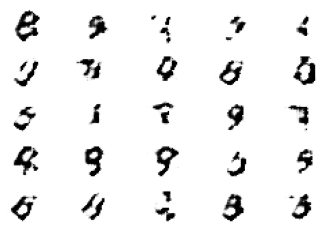

<h1 align="center">Welcome to MNIST-GAN 👋</h1>

> A simple, yet quite effective Generative Adversial Network (GAN) which rapidly generates batches of numbers (0-9)

  

## Author

👤 **Paul Colandrea**

- Github: [@pdcolandrea](https://github.com/pdcolandrea)
- LinkedIn: [@pdcolandrea](https://linkedin.com/in/pdcolandrea)

## Show your support

Give a ⭐️ if this project helped you!

---

_This README was generated with ❤️ by [readme-md-generator](https://github.com/kefranabg/readme-md-generator)_
